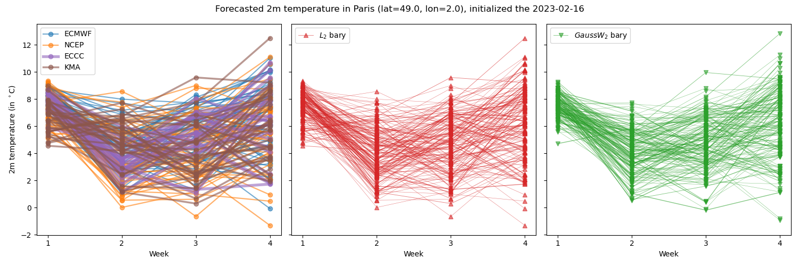

# Optimal Transport for Multi-Model Ensembles 

This repository contains Python code for computing multi-model ensemble forecasts using the barycenter-based approach described in the manuscript ''A barycenter-based approach for the multi-model ensembling of subseasonal forecasts''. We implement three methods: the **L2 barycenter**, the **Wasserstein barycenter** and its **Gaussian approximation (GaussW2)**.

<figure> <figcaption>Example of barycenter-MMEs</figcaption></figure>


---

## Repository Structure
- `src/main_barycenters.py`: Computes the L2 and GaussW2 barycenters for a case example.
- `src/barycenter_functions.py`: Functions for computing the barycenters.
- `src/main_evaluate.py`: Evaluates ensemble forecast performance and generates plots.
- `src/evaluate_functions.py`: Functions for evaluating ensemble forecasts.
- `src/read_data.py`: Functions for reading and formatting the data.
- `data/`: Folder for input data (ensemble forecasts, climatology, and reference). The full dataset needed to reproduce the case study is available on zenodo (https://doi.org/10.5281/zenodo.15038871).
- `results/output/`: Stores output files (e.g. computed barycenters, evaluation metrics).
- `results/plots/`: Contains generated plots.


## Requirements
Requires NumPy, pandas, Xarray, POT, properscoring, Matplotlib, Cartopy and their dependencies.


## Usage 
### Compute barycenters:
```bash
python src/main_barycenters.py
```
This script:
- Reads ensemble forecast data from four single-model forecasts.
- Computes the L2 and GaussW2 barycenters.
- Saves results as NetCDF files.
- Plots barycenters for a selected point and start date (for visualization purposes).

### Evaluate ensemble forecast performance
To compute CRPS-related scores and the SSR for the two barycenter-based MMEs and the four single-model ensembles, and generate plots:
```bash
python src/main_evaluate.py
```


## License and Citation
### License
This project is licensed under the MIT License - see the [LICENSE](LICENSE) file for details.

### Citation
If you use this code, please cite: 
> Le Coz, C. (2025). Code for "A barycenter-based approach for the multi-model ensembling of subseasonal forecasts" (v1.0). Zenodo. https://doi.org/10.5281/zenodo.15058502
